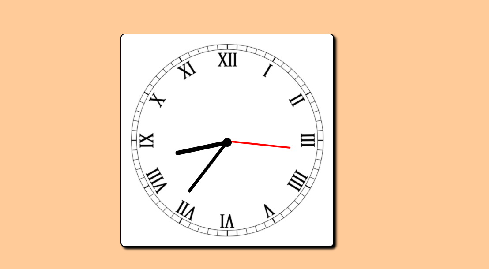

<h1># An analouge clock made with javascript</h1>

This is a simple javascript project to create analouge clock by using the date object.

</h1>Additional description about the project and its features.</h1>

<h2>Built With</h2>

Html

CSS

Javascript

<h2>Live Demo</h2>
https://combinationlock.netlify.app/

<h2>Getting Started</h2>
To get a local copy up and running follow these simple example steps.

Clone the repository and get the files in your local branch. Use it according
to your convenience.

Prerequisites
Text editor,Github profile and Git.

<h2>Authors</h2>

👤 Author1

Github: @ajkacca457

Twitter: @ajkacca

Linkedin: https://www.linkedin.com/in/avijit-karmaker-8738a54a/

🤝 Contributing
Contributions, issues and feature requests are welcome!

Feel free to check the issues page.

Show your support
Give a ⭐️ if you like this project!

📝 <h2>License</h2>
This project is a personal project of Avijit.
